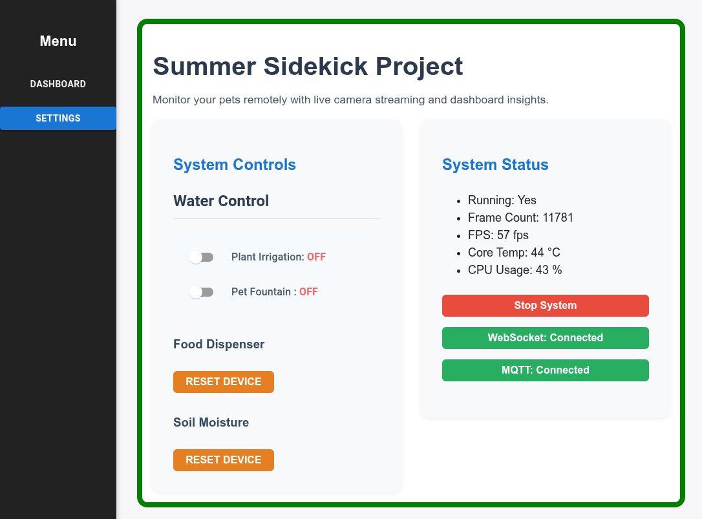

# axelera.ai-summer-sidekick
Pioneer 10 - Axelera AI Vision Challenge


This project contains all files to execute and replicate the Project Summer
SideKick for PIONEER 10 Challeged proposed by AXELERA AI.

## Folder Descriptions

- `notebooks/`:   Jupyter notebooks for training, finetuning, and exporting YOLO and MobileNet models.
- `labels/`: Contains label files and annotation data for the datasets.
- `embedded/`:  All source code for the embedded projects related to the challenge.
- `scripts/`: Useful scripts for copying files, transforming annotation formats, and automating deployment to Axelera hardware.
- `diagrams/`: The diagrams to explain the project architecure
- `voyager-sdk`: The content that should be copied to the voyager-sdk folder on the board. It contains the models and the backend implementation.
- `mqtt`: The configuration file of mosquitto server.
# Project Resume

## 1. Project Overview
This system was developed to monitor the well-being of plants and pets, enabling people to enjoy their summer vacations with peace of mind. The solution provides remote monitoring and control, ensuring that users can check on and maintain their home environment from anywhere.

The objective of the challenge was to create an AI-powered system that uses machine learning models to analyze sensor and camera data, and actively interacts with the physical world to maintain optimal conditions for plants and pets.

### Key Achievements and Outcomes
- Automated detection of pet food bowl level and triggering of refilling when needed.
- Monitoring of pet activity to ensure pets are present and active at home.
- Detection and monitoring of pet fountain water level.
- Plant health assessment using AI models.
- Remote control of plant irrigation and pet fountain systems.
- Integration of live camera streaming for real-time monitoring.
- User-friendly dashboard for remote status checks and system control.

## 2. System Architecture
The system architecture consists of several integrated components:


The system architecture diagram illustrates the input sources (sensors and cameras), the outputs (web application and actuators), and the central backend, which consists of the MQTT broker and server.


## 3. Main Components

This section brings more details  the hardware, software and ai components.

- Hardware components.

- **Low-Level Components:**
  - Sensors: Soil moisture sensors placed on the potted plant.
  - Camera: Captures images and video streams to monitor pet activity, food and water levels and plant health.
  - Actuators: Control valves for filling the pet fountain and plant irrigation system.

- **Backend:**
  - AI System: Processes camera data to detect pet presence, monitor fountain water level, assess bowl food level, and evaluate plant health.
  - WebSocket Server: Exposes system status and real-time updates to the frontend for live monitoring.
  - MQTT Broker: Implements a publish-subscribe mechanism, commonly used in IoT projects, to control actuators and receive sensor data.

- **Frontend:**
  - Web Application: Provides a "user-friendly" dashboard for monitoring system status, viewing live camera, and configuring some system settings remotely.

## 4. Implementation Details

**Hardware:**

I wrote a detailed post about the hardware implementation in Axelera AI blog. You can acces them using the links below.

[System Mounting and Hardware Setup Guide - Part 1](https://community.axelera.ai/project-challenge-recognize-react-27/summer-sidekick-update-hardware-setup-custom-boards-474?tid=474&fid=27)
[System Mounting and Hardware Setup Guide - Part 2 ](https://community.axelera.ai/project-challenge-recognize-react-27/summer-sidekick-update-hardwate-setup-kit-usage-and-further-488)

**Firmware:**

You can find the firmware in the [embedded](embedded/) folder.
The [lwip](https://savannah.nongnu.org/projects/lwip/) library was used to interact with the MQTT broker.
The [Rapsberry pi pico SDK and VSCode](https://www.raspberrypi.com/news/get-started-with-raspberry-pi-pico-series-and-vs-code/) was used to interact with the microcontroller components, ADC, IO, PWMS, etc.

**MQTT Broker**

I chose a ligthwheit mqtt broker called [mosquitto](https://mosquitto.org/) which is available on Embedded Linux distributions. To avoid compatiblity problems I chose to deploy the broker on another raspberry pi 5 board. I found it easier to debug and deploy.
This package is very simple to use and proposes some tools to publish and subscribe to topics.
For this project mosquitto configuration file is found in the [mqtt] folder.

**Backend**

The backend contains two main parts, the inference and, the APIs :
The Inference : The Voyager-SDK enters here with the organization of the pipeline and the models deployment. The definition of custom models were found [voyager-sdk/customers/models].
The model pipeline definition used for the demo is the  [yolo11m-v4-coco-custom-cascade-tracker.yaml](voyager-sdk/customers/models/yolo11m-v4-coco-custom-cascade-tracker.yaml)
One file was used for the inference, [inference.py](voyager-sdk/application/app/inference.py). Two types of apis were exposed, one in REST to collect some system information on one shot basis and control system startup, and another one to continuously send the system informations and camera streams was implementd in Websockets. The whole backend was develped in FastAPI.
You can get futher details about the deployement and execution in [README.APP.md](voyager-sdk/README.APP.md)

**Pipeline**

The models were developed using Pythorch, the code and the models are available on [notebooks](notebooks/) folder.
Unfortunatly, I still need a solution to share the dataset effectivly. If you have an idea let me know.

This pipeline was composed by 5 computer vision models.


- Integration and deployment strategy.

Four custom models were created during this challenge. Their training and validation process are available on the [nortebooks] folder.

⚠️ Due to my knowledge limitation on voyager-sdk I did not succed to put all 5 models on Mentis, just 4 of them. I removed the fountain level from the pipeline for the demo video

During the pipeline development I wrote this blog post you can find here:
[Summer Sidekick Update: Running AI on Mentis!](https://community.axelera.ai/project-challenge-recognize-react-27/summer-sidekick-update-running-ai-on-mentis-973?tid=973&fid=27)

**FrontEnd**

The frontend is writen in REACT.js and it concentrates all system information a two screen. The dashboards which has the current system status and allows system control over water valves.


 The another one is the setting which allows to see the actual system status and control some device parameters.



## 5. Results & Evaluation

For models training and evaluation use  I try to use the matrix confusion and accuracy to evaluate the models. Here you have an extract of these parameters for the bowl_level models evaluation,  with 97.5% of accuracy and a food shape of confusion matrix,  it is not so bad :).

```
Using device: cuda

--- Model Evaluation ---
Accuracy: 0.9750

Confusion Matrix:
[[ 6  0  1]
 [ 0 16  0]
 [ 0  0 17]]

Classification Report:
              precision    recall  f1-score   support

  bowl_empty       1.00      0.86      0.92         7
   bowl_full       1.00      1.00      1.00        16
   bowl_half       0.94      1.00      0.97        17

    accuracy                           0.97        40
   macro avg       0.98      0.95      0.96        40
weighted avg       0.98      0.97      0.97        40
```

For the entire system validation I try to grab my daughet's cat and put it in front of the camera for detection and fill and empty the bowl to make sure that detection is good to avoid the cat starvation.

## 6. Challenges & Solutions

I was challenge that involved a lot of small systems to build almost fron scratch. Which was source of funny during all the process. As you image I learn a lot during all this process. Have a dedicated place to create a small pet environemnt which support cameras was also a challenge due space limitations.

The model creations was a source of challenge equily, the entire process for data aquisition, data annotation (the most time consumming) and training represents a huge evaluation loop, which can be a very time consuming task.  During this process onf of the finetunned models presented catastrogic forgeting while finetuned. The techniques I tried to apply did not work as espected, and I have to work with two diffenrent YOLO models. It worked :) .

## 7. Demos

