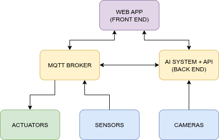
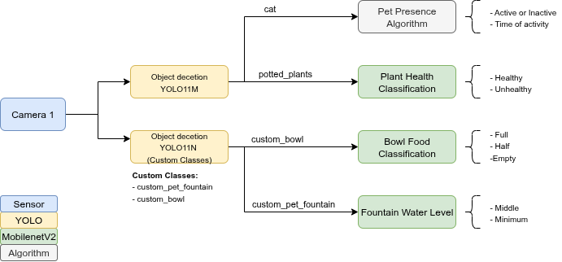
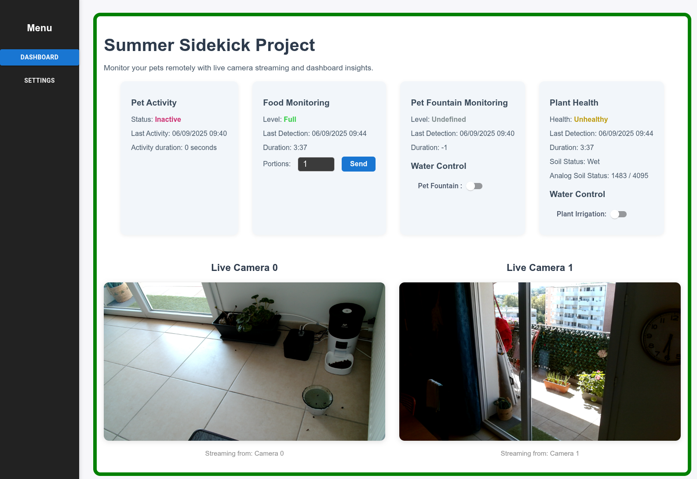
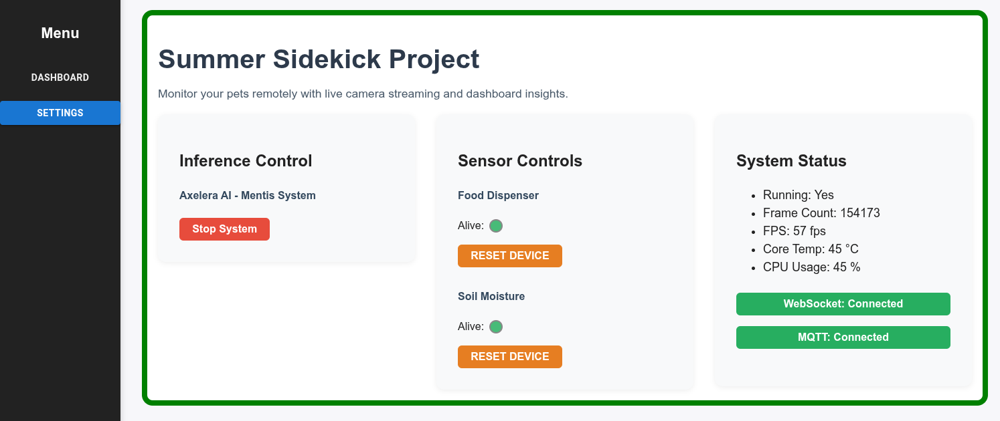

# 🐱 Summer Sidekick - Axelera AI 🪴
## Pioneer 10 - Axelera AI Vision Challenge

<!-- You can use these icons for water and pet food throughout the document: -->
<!-- Water: 💧 -->
<!-- Pet Food: 🍖 -->

## Demos

I’m sharing a short video 🎬 [Platform Demo](https://youtu.be/knuxPkaQmX4) (still without audio — I’m looking for an easy-to-use app for adding narration). The demo is fairly self-explanatory, but here’s a quick breakdown:
1) Automatic food dispenser
* At the start of the video, you can see the bowl empty.
* When the bowl is empty, the algorithm waits about one minute before triggering the food dispenser.
* Take a look at Live Camera 0.
* You can also observe the monitoring status updating as the bowl becomes full.

2) Pet activity detection

* In the second part of the video, detection is triggered when the cat walks in front of the camera.
* (Now I just need to motivate my daughter’s cat to cooperate 😅.)
* When the cat goes out, the period of activity is available to ensure the last activity.


You can fide a video with all models running on Metis : 🎬 [All Models Demo](https://youtu.be/GOBVkfP_o00)

# Project Summary

## 1. Project Overview
This system was developed to monitor the well-being of plants and pets, enabling people to enjoy their summer vacations with peace of mind. The solution provides remote monitoring and control, ensuring users can check on and maintain their home environment from anywhere.

The objective of the challenge was to create an AI-powered system that uses machine learning models to analyze sensor and camera data, and actively interacts with the physical world to maintain optimal conditions for plants and pets.

### Key Achievements and Outcomes
- Automated detection of pet food bowl level and triggering of refilling when needed.
- Monitoring of pet activity to ensure pets are present and active at home.
- Detection and monitoring of pet fountain water level.
- Plant health assessment using AI models.
- Remote control of plant irrigation and pet fountain systems.
- Integration of live camera streaming for real-time monitoring.
- User-friendly dashboard for remote status checks and system control.

## 2. System Architecture

The system architecture consists of several integrated components:



The system architecture diagram illustrates the input sources (sensor and cameras), the outputs (web application and actuators), and the central backend, which consists of the MQTT broker and server.

## 3. Main Components

This section brings more details about the hardware, software, and AI components.

- **Low-Level Components:**
  - Sensor: Soil moisture sensor placed on the potted plant.
  - Camera: Captures images and video streams to monitor pet activity, food and water levels, and plant health.
  - Actuators: Control valves for filling the pet fountain and plant irrigation system.

- **Backend:**
  - AI System: Processes camera data to detect pet presence, monitor fountain water level, assess bowl food level, and evaluate plant health.
  - Server: Exposes system status and real-time updates to the frontend for live monitoring via Websockets and start/stop system control via REST API.
  - MQTT Broker: Implements a publish-subscribe mechanism, commonly used in IoT projects, to control actuators and receive sensor data.

- **Frontend:**
  - Web Application: Provides a "user-friendly" dashboard for monitoring system status, viewing live camera feeds, and configuring some system settings remotely.

## 4. Implementation Details

**Hardware:**

I wrote a detailed post about the hardware implementation in the Axelera AI blog. You can access them using the links below.

[System Mounting and Hardware Setup Guide - Part 1](https://community.axelera.ai/project-challenge-recognize-react-27/summer-sidekick-update-hardware-setup-custom-boards-474?tid=474&fid=27)
[System Mounting and Hardware Setup Guide - Part 2](https://community.axelera.ai/project-challenge-recognize-react-27/summer-sidekick-update-hardwate-setup-kit-usage-and-further-488)

**Firmware:**

You can find the firmware in the [embedded](embedded/) folder.
The [lwip](https://savannah.nongnu.org/projects/lwip/) library was used to interact with the MQTT broker.
The [Raspberry Pi Pico SDK and VSCode](https://www.raspberrypi.com/news/get-started-with-raspberry-pi-pico-series-and-vs-code/) were used to interact with the microcontroller components, ADC, IO, PWMs, etc.

**MQTT Broker**

I chose a lightweight MQTT broker called [mosquitto](https://mosquitto.org/) which is available on Embedded Linux distributions. To avoid compatibility problems, I chose to deploy the broker on another Raspberry Pi 5 board. I found it easier to debug and deploy.
This package is very simple to use and provides some tools to publish and subscribe to topics.
For this project, the mosquitto configuration file is found in the [mqtt] folder.

**Backend**

The backend contains two main parts: inference and APIs.
The Inference: The Voyager-SDK comes into play here with the organization of the pipeline and model deployment. The definition of custom models can be found in [voyager-sdk/customers/models].
The model pipeline definition used for the demo is [yolo11m-v4-coco-custom-cascade-tracker.yaml](voyager-sdk/customers/models/yolo11m-v4-coco-custom-cascade-tracker.yaml).
One file was used for inference, [inference.py](voyager-sdk/application/app/inference.py). Two types of APIs were exposed: one in REST to collect some system information on a one-shot basis and control system startup, and another to continuously send system information and camera streams, implemented in WebSockets. The whole backend was developed in FastAPI.
You can get further details about deployment and execution in [README.APP.md](voyager-sdk/README.APP.md).

**Pipeline**

The models were developed using PyTorch, and the code and models are available in the [notebooks](notebooks/) folder.
Unfortunately, I still need a solution to share the dataset effectively. If you have an idea, let me know.

This pipeline was composed of 5 computer vision models.



Four custom models were created/finetunned during this challenge. Their training and validation process are available in the [notebooks] folder.

⚠️ Due to my limited knowledge of voyager-sdk, I did not succeed in putting all 5 models on Mentis, just 4 of them. I removed the fountain level from the pipeline for the demo videos.

During the pipeline development, I wrote this blog post you can find here:
[Summer Sidekick Update: Running AI on Mentis!](https://community.axelera.ai/project-challenge-recognize-react-27/summer-sidekick-update-running-ai-on-mentis-973?tid=973&fid=27)

**FrontEnd**

The frontend is written in REACT.js and concentrates all system information on two screens. The dashboard shows the current system status and allows system control over water valves.



The other screen is the settings, which allows you to see the actual system status and control some device parameters.



## 5. Results & Evaluation

For model training and evaluation, I tried to use the confusion matrix and accuracy to evaluate the models. Here you have an extract of these parameters for the bowl_level model evaluation, with 97.5% accuracy and a nice-looking confusion matrix. Not so bad :).

```
Using device: cuda

--- Model Evaluation ---
Accuracy: 0.9750

Confusion Matrix:
[[ 6  0  1]
 [ 0 16  0]
 [ 0  0 17]]

Classification Report:
              precision    recall  f1-score   support

  bowl_empty       1.00      0.86      0.92         7
   bowl_full       1.00      1.00      1.00        16
   bowl_half       0.94      1.00      0.97        17

    accuracy                           0.97        40
   macro avg       0.98      0.95      0.96        40
weighted avg       0.98      0.97      0.97        40
```

For the entire system validation, I tried to grab my daughter's cat and put it in front of the camera for detection, and filled and emptied the bowl to make sure detection is good enough to avoid cat starvation.

## 6. Challenges & Solutions

This was a challenge that involved building a lot of small systems almost from scratch, which was a source of fun during the whole process. As you can imagine, I learned a lot during all this. Having a dedicated place to create a small pet environment that supports cameras was also a challenge due to space limitations.

Model creation was equally challenging—the entire process for data acquisition, data annotation (the most time-consuming), and training represents a huge evaluation loop, which can be a very time-consuming task. During this process, one of the finetuned models presented catastrophic forgetting while finetuning. The techniques I tried to apply did not work as expected, and I had to work with two different YOLO models. It worked :) .


## 7. Folder Descriptions

- `diagrams/`: Diagrams to explain the project architecture.
- `embedded/`: All source code for the embedded projects related to the challenge.
- `labels/`: Contains label files and annotation data for the datasets.
- `notebooks/`: Jupyter notebooks for training, finetuning, and exporting YOLO and MobileNet models.
- `scripts/`: Useful scripts for copying files, transforming annotation formats, and automating deployment to Axelera hardware.
- `mqtt/`: Configuration file for the mosquitto server.
- `voyager-sdk/`: Content to be copied to the voyager-sdk folder on the board. It contains the models and backend implementation.
- `webapp-summersidekick/`: Contains the code source of the webapp application.

## 8. Other README files

- `voyager-sdk/README.APP.md`: Contains intructions to deploy the backend application on Axelera Board
- `webapp-summersidekick/README.md`: Contains intructions to develop, to compile and to deploy the webapp on Axelera Board
